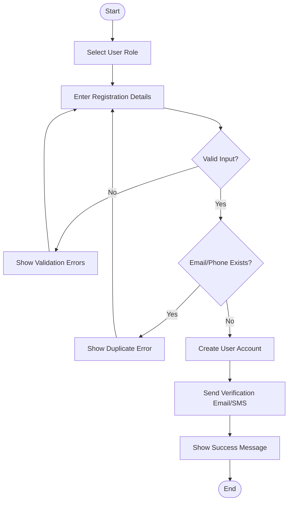
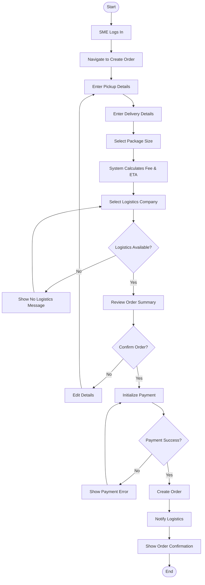
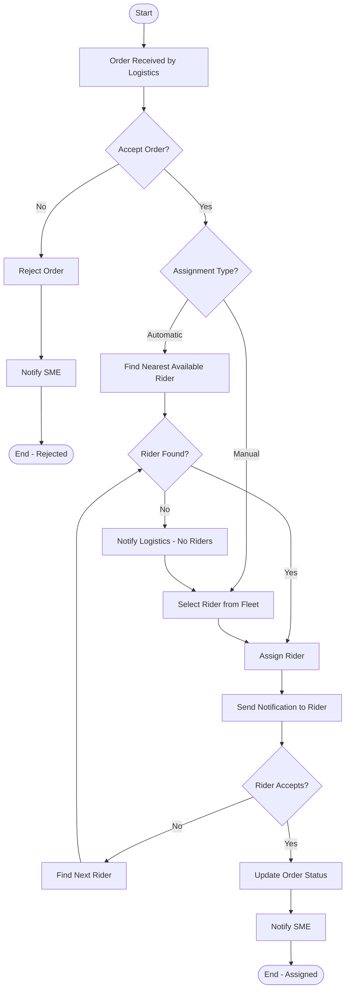
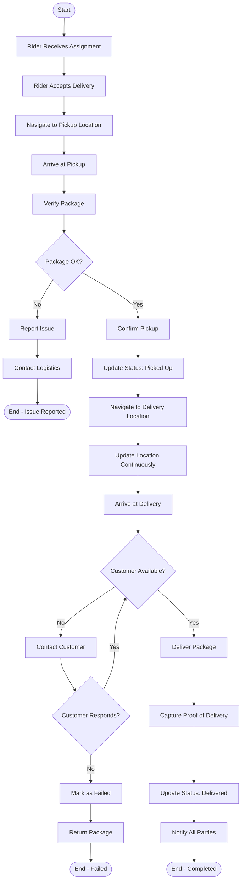
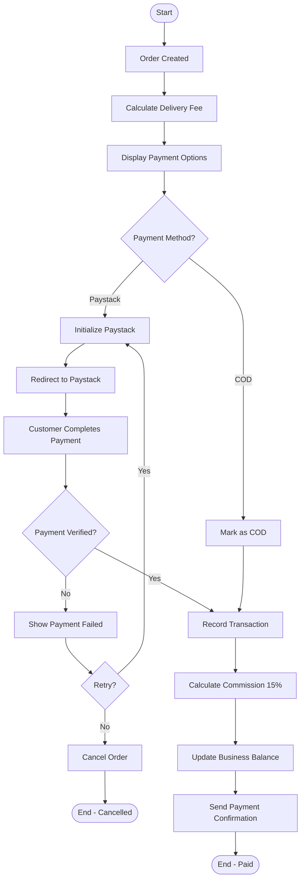
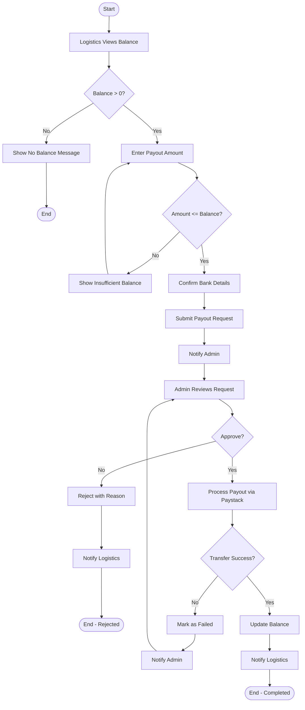
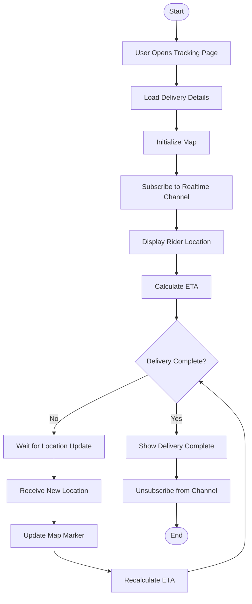

# Activity Diagrams - Lifterico

## 1. User Registration Flow



---

## 2. Order Creation Flow



---

## 3. Rider Assignment Flow



---

## 4. Delivery Execution Flow



---

## 5. Payment Flow



---

## 6. Payout Request Flow



---

## 7. Business Verification Flow

```mermaid
flowchart TD
    A([Start]) --> B[Business Registers]
    B --> C[Access Restricted Dashboard]
    C --> D{Profile Complete?}
    D -->|No (< 70%)| E[Show 'Complete Profile' Prompt]
    E --> F[User Updates Profile]
    F --> D
    D -->|Yes| G{Documents Uploaded?}
    G -->|No| H[Show 'Upload Documents' Prompt]
    H --> I[User Uploads Documents]
    I --> J[Submit for Verification]
    J --> K[Status: Pending]
    K --> L[Show 'Verification In Progress' Status]
    L --> M[Admin Notified]
    M --> N[Admin Reviews Documents]
    N --> O{Documents Valid?}
    O -->|No| P{Fixable?}
    P -->|Yes| Q[Request Re-upload]
    Q --> R[Notify Business]
    R --> H
    P -->|No| S[Reject Business]
    S --> T[Send Rejection Reason]
    T --> U([End - Rejected])
    O -->|Yes| V[Approve Business]
    V --> W[Status: Verified]
    W --> X[Notify Business Owner]
    X --> Y[Enable Full Features]
    Y --> Z([End - Verified])
```

---

## 8. Real-time Tracking Flow


