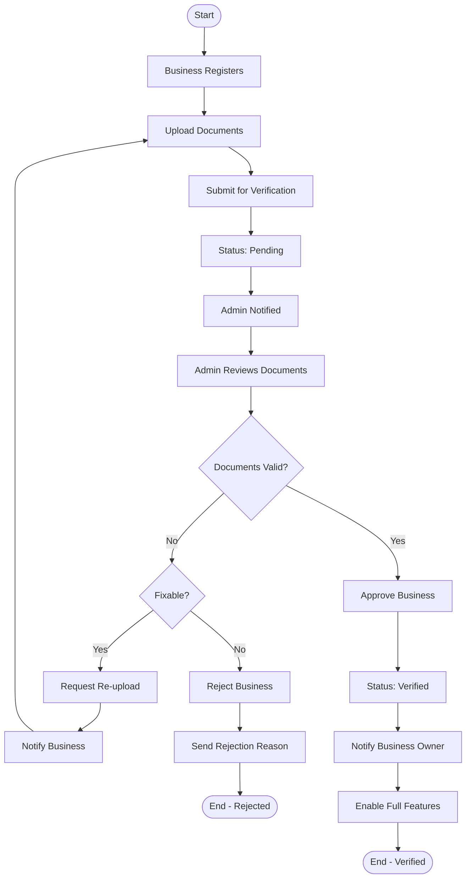

# Activity Diagrams - Lifterico

## 1. User Registration Flow

---

## 2. Order Creation Flow

---

## 3. Rider Assignment Flow

---

## 4. Delivery Execution Flow

---

## 5. Payment Flow

---

## 6. Payout Request Flow

---

## 7. Business Verification Flow

---

## 8. Real-time Tracking Flow

