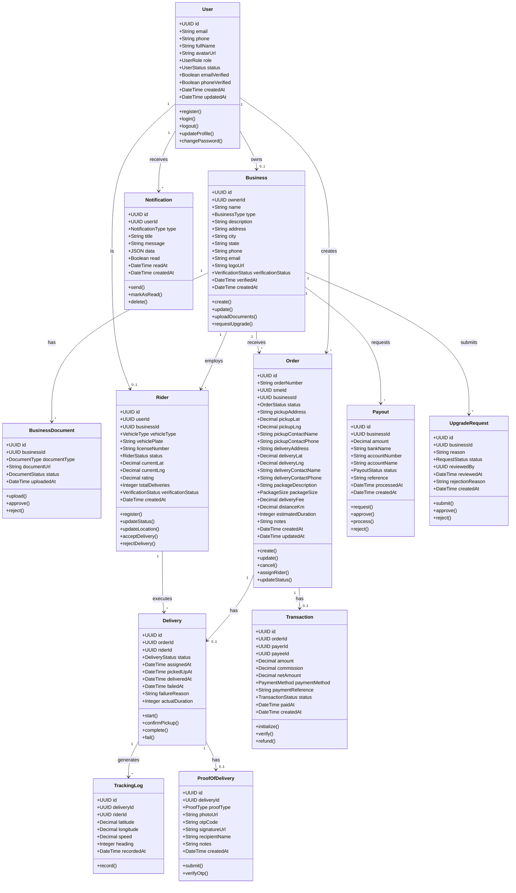

# Class Diagram - Lifterico

## System Class Diagram

```mermaid
classDiagram
    class User {
        +UUID id
        +String email
        +String phone
        +String fullName
        +String avatarUrl
        +UserRole role
        +UserStatus status
        +Boolean emailVerified
        +Boolean phoneVerified
        +DateTime createdAt
        +DateTime updatedAt
        +register()
        +login()
        +logout()
        +updateProfile()
        +changePassword()
    }

    class Business {
        +UUID id
        +UUID ownerId
        +String name
        +BusinessType type
        +String description
        +String address
        +String city
        +String state
        +String phone
        +String email
        +String logoUrl
        +VerificationStatus verificationStatus
        +DateTime verifiedAt
        +DateTime createdAt
        +create()
        +update()
        +uploadDocuments()
        +requestUpgrade()
    }

    class BusinessDocument {
        +UUID id
        +UUID businessId
        +DocumentType documentType
        +String documentUrl
        +DocumentStatus status
        +DateTime uploadedAt
        +upload()
        +approve()
        +reject()
    }

    class Rider {
        +UUID id
        +UUID userId
        +UUID businessId
        +VehicleType vehicleType
        +String vehiclePlate
        +String licenseNumber
        +RiderStatus status
        +Decimal currentLat
        +Decimal currentLng
        +Decimal rating
        +Integer totalDeliveries
        +VerificationStatus verificationStatus
        +DateTime createdAt
        +register()
        +updateStatus()
        +updateLocation()
        +acceptDelivery()
        +rejectDelivery()
    }

    class Order {
        +UUID id
        +String orderNumber
        +UUID smeId
        +UUID businessId
        +OrderStatus status
        +String pickupAddress
        +Decimal pickupLat
        +Decimal pickupLng
        +String pickupContactName
        +String pickupContactPhone
        +String deliveryAddress
        +Decimal deliveryLat
        +Decimal deliveryLng
        +String deliveryContactName
        +String deliveryContactPhone
        +String packageDescription
        +PackageSize packageSize
        +Decimal deliveryFee
        +Decimal distanceKm
        +Integer estimatedDuration
        +String notes
        +DateTime createdAt
        +DateTime updatedAt
        +create()
        +update()
        +cancel()
        +assignRider()
        +updateStatus()
    }

    class Delivery {
        +UUID id
        +UUID orderId
        +UUID riderId
        +DeliveryStatus status
        +DateTime assignedAt
        +DateTime pickedUpAt
        +DateTime deliveredAt
        +DateTime failedAt
        +String failureReason
        +Integer actualDuration
        +start()
        +confirmPickup()
        +complete()
        +fail()
    }

    class TrackingLog {
        +UUID id
        +UUID deliveryId
        +UUID riderId
        +Decimal latitude
        +Decimal longitude
        +Decimal speed
        +Integer heading
        +DateTime recordedAt
        +record()
    }

    class ProofOfDelivery {
        +UUID id
        +UUID deliveryId
        +ProofType proofType
        +String photoUrl
        +String otpCode
        +String signatureUrl
        +String recipientName
        +String notes
        +DateTime createdAt
        +submit()
        +verifyOtp()
    }

    class Transaction {
        +UUID id
        +UUID orderId
        +UUID payerId
        +UUID payeeId
        +Decimal amount
        +Decimal commission
        +Decimal netAmount
        +PaymentMethod paymentMethod
        +String paymentReference
        +TransactionStatus status
        +DateTime paidAt
        +DateTime createdAt
        +initialize()
        +verify()
        +refund()
    }

    class Payout {
        +UUID id
        +UUID businessId
        +Decimal amount
        +String bankName
        +String accountNumber
        +String accountName
        +PayoutStatus status
        +String reference
        +DateTime processedAt
        +DateTime createdAt
        +request()
        +approve()
        +process()
        +reject()
    }

    class Notification {
        +UUID id
        +UUID userId
        +NotificationType type
        +String title
        +String message
        +JSON data
        +Boolean read
        +DateTime readAt
        +DateTime createdAt
        +send()
        +markAsRead()
        +delete()
    }

    class UpgradeRequest {
        +UUID id
        +UUID businessId
        +String reason
        +RequestStatus status
        +UUID reviewedBy
        +DateTime reviewedAt
        +String rejectionReason
        +DateTime createdAt
        +submit()
        +approve()
        +reject()
    }

    %% Relationships
    User "1" --> "0..1" Business : owns
    Business "1" --> "*" BusinessDocument : has
    Business "1" --> "*" Rider : employs
    User "1" --> "0..1" Rider : is
    User "1" --> "*" Order : creates
    Business "1" --> "*" Order : receives
    Order "1" --> "0..1" Delivery : has
    Rider "1" --> "*" Delivery : executes
    Delivery "1" --> "*" TrackingLog : generates
    Delivery "1" --> "0..1" ProofOfDelivery : has
    Order "1" --> "0..1" Transaction : has
    Business "1" --> "*" Payout : requests
    User "1" --> "*" Notification : receives
    Business "1" --> "*" UpgradeRequest : submits
```

---

## Enumerations

```mermaid
classDiagram
    class UserRole {
        <<enumeration>>
        ADMIN
        LOGISTICS
        SME
        RIDER
        CUSTOMER
    }

    class UserStatus {
        <<enumeration>>
        ACTIVE
        INACTIVE
        SUSPENDED
        PENDING
    }

    class BusinessType {
        <<enumeration>>
        LOGISTICS
        SME
    }

    class VerificationStatus {
        <<enumeration>>
        PENDING
        VERIFIED
        REJECTED
    }

    class RiderStatus {
        <<enumeration>>
        OFFLINE
        ONLINE
        BUSY
        ON_DELIVERY
    }

    class OrderStatus {
        <<enumeration>>
        PENDING
        ACCEPTED
        ASSIGNED
        PICKED_UP
        IN_TRANSIT
        DELIVERED
        CANCELLED
        FAILED
    }

    class DeliveryStatus {
        <<enumeration>>
        ASSIGNED
        PICKED_UP
        IN_TRANSIT
        DELIVERED
        FAILED
        RETURNED
    }

    class PackageSize {
        <<enumeration>>
        SMALL
        MEDIUM
        LARGE
    }

    class VehicleType {
        <<enumeration>>
        MOTORCYCLE
        BICYCLE
        CAR
    }

    class ProofType {
        <<enumeration>>
        PHOTO
        OTP
        SIGNATURE
    }

    class PaymentMethod {
        <<enumeration>>
        PAYSTACK
        WALLET
        COD
    }

    class TransactionStatus {
        <<enumeration>>
        PENDING
        COMPLETED
        FAILED
        REFUNDED
    }

    class PayoutStatus {
        <<enumeration>>
        PENDING
        PROCESSING
        COMPLETED
        FAILED
    }

    class NotificationType {
        <<enumeration>>
        ORDER
        DELIVERY
        PAYMENT
        SYSTEM
    }
```

---

## Service Classes

```mermaid
classDiagram
    class AuthService {
        +register(userData)
        +login(credentials)
        +logout()
        +refreshToken()
        +resetPassword(email)
        +verifyEmail(token)
        +verifyPhone(otp)
    }

    class OrderService {
        +createOrder(orderData)
        +getOrders(filters)
        +getOrderById(id)
        +updateOrder(id, data)
        +cancelOrder(id)
        +assignRider(orderId, riderId)
    }

    class DeliveryService {
        +startDelivery(deliveryId)
        +confirmPickup(deliveryId)
        +completeDelivery(deliveryId, proof)
        +failDelivery(deliveryId, reason)
        +getDeliveryStatus(deliveryId)
    }

    class TrackingService {
        +updateLocation(riderId, location)
        +getRiderLocation(riderId)
        +getDeliveryTracking(deliveryId)
        +calculateETA(origin, destination)
        +subscribeToUpdates(deliveryId)
    }

    class PaymentService {
        +initializePayment(orderId, amount)
        +verifyPayment(reference)
        +processRefund(transactionId)
        +calculateCommission(amount)
        +getTransactionHistory(userId)
    }

    class PayoutService {
        +requestPayout(businessId, amount)
        +approvePayout(payoutId)
        +processPayout(payoutId)
        +rejectPayout(payoutId, reason)
        +getPayoutHistory(businessId)
    }

    class NotificationService {
        +sendNotification(userId, notification)
        +sendSMS(phone, message)
        +sendPushNotification(userId, data)
        +sendEmail(email, template, data)
        +markAsRead(notificationId)
    }

    class AnalyticsService {
        +getDashboardStats(userId)
        +getOrderAnalytics(filters)
        +getRevenueAnalytics(filters)
        +getPerformanceMetrics(filters)
        +exportReport(type, filters)
    }
```
