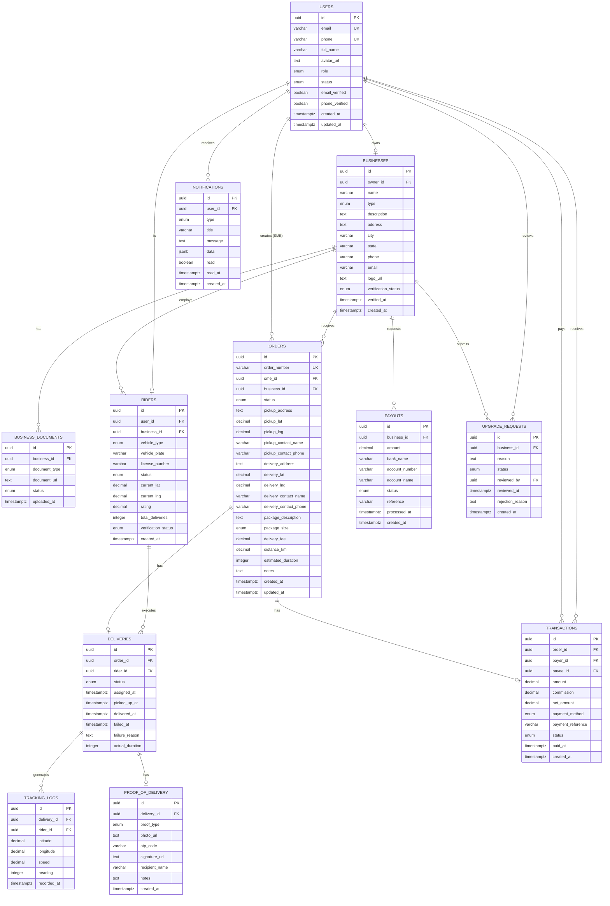

# Entity Relationship Diagram - Lifterico

## Complete ER Diagram



---

## Simplified ER Diagram (Core Entities)


---

## Relationship Descriptions

| Relationship | Type | Description |
|--------------|------|-------------|
| Users → Businesses | 1:0..1 | A user can own at most one business |
| Businesses → Business_Documents | 1:N | A business can have multiple documents |
| Businesses → Riders | 1:N | A logistics business can have many riders |
| Users → Riders | 1:0..1 | A user can be at most one rider |
| Users → Orders | 1:N | An SME user can create many orders |
| Businesses → Orders | 1:N | A logistics business can receive many orders |
| Orders → Deliveries | 1:0..1 | An order has at most one active delivery |
| Riders → Deliveries | 1:N | A rider can execute many deliveries |
| Deliveries → Tracking_Logs | 1:N | A delivery has many location logs |
| Deliveries → Proof_of_Delivery | 1:0..1 | A delivery has at most one proof |
| Orders → Transactions | 1:0..1 | An order has at most one transaction |
| Businesses → Payouts | 1:N | A business can request many payouts |
| Users → Notifications | 1:N | A user can have many notifications |
| Businesses → Upgrade_Requests | 1:N | A business can submit upgrade requests |

---

## Cardinality Summary

```
Users (1) ────────── (0..1) Businesses
Businesses (1) ───── (0..N) Business_Documents
Businesses (1) ───── (0..N) Riders
Users (1) ────────── (0..1) Riders
Users (1) ────────── (0..N) Orders
Businesses (1) ───── (0..N) Orders
Orders (1) ────────── (0..1) Deliveries
Riders (1) ────────── (0..N) Deliveries
Deliveries (1) ───── (0..N) Tracking_Logs
Deliveries (1) ───── (0..1) Proof_of_Delivery
Orders (1) ────────── (0..1) Transactions
Businesses (1) ───── (0..N) Payouts
Users (1) ────────── (0..N) Notifications
```
