# Use Case Diagram - Lifterico

## System Use Case Diagram

```mermaid
flowchart TB
    subgraph Actors
        Admin((Admin))
        Logistics((Logistics))
        SME((SME))
        Rider((Rider))
        Customer((Customer))
    end

    subgraph "Authentication Module"
        UC1[Register]
        UC2[Login]
        UC3[Reset Password]
    end

    subgraph "Business Module"
        UC4[Register Business]
        UC5[Verify Business]
        UC6[Request Upgrade]
    end

    subgraph "Rider Module"
        UC7[Onboard Rider]
        UC8[Manage Fleet]
        UC9[Update Status]
    end

    subgraph "Order Module"
        UC10[Create Order]
        UC11[Assign Rider]
        UC12[Cancel Order]
    end

    subgraph "Delivery Module"
        UC13[Execute Delivery]
        UC14[Update Status]
        UC15[Submit Proof]
    end

    subgraph "Tracking Module"
        UC16[Track Delivery]
        UC17[Update Location]
    end

    subgraph "Payment Module"
        UC18[Make Payment]
        UC19[Request Payout]
    end

    subgraph "Analytics Module"
        UC20[View Reports]
    end

    %% Admin
    Admin --> UC1
    Admin --> UC5
    Admin --> UC6
    Admin --> UC19
    Admin --> UC20

    %% Logistics
    Logistics --> UC1
    Logistics --> UC4
    Logistics --> UC7
    Logistics --> UC8
    Logistics --> UC11
    Logistics --> UC16
    Logistics --> UC19
    Logistics --> UC20

    %% SME
    SME --> UC1
    SME --> UC4
    SME --> UC6
    SME --> UC10
    SME --> UC12
    SME --> UC16
    SME --> UC18
    SME --> UC20

    %% Rider
    Rider --> UC1
    Rider --> UC9
    Rider --> UC13
    Rider --> UC14
    Rider --> UC15
    Rider --> UC17

    %% Customer
    Customer --> UC16
```

---

## Actor-Use Case Matrix

| Use Case | Admin | Logistics | SME | Rider | Customer |
|----------|-------|-----------|-----|-------|----------|
| Register | ✅ | ✅ | ✅ | ✅ | ✅ |
| Login | ✅ | ✅ | ✅ | ✅ | ✅ |
| Register Business | ❌ | ✅ | ✅ | ❌ | ❌ |
| Verify Business | ✅ | ❌ | ❌ | ❌ | ❌ |
| Request Upgrade | ❌ | ❌ | ✅ | ❌ | ❌ |
| Approve Upgrade | ✅ | ❌ | ❌ | ❌ | ❌ |
| Onboard Rider | ❌ | ✅ | ❌ | ❌ | ❌ |
| Manage Fleet | ❌ | ✅ | ❌ | ❌ | ❌ |
| Update Rider Status | ❌ | ❌ | ❌ | ✅ | ❌ |
| Create Order | ❌ | ❌ | ✅ | ❌ | ❌ |
| Assign Rider | ❌ | ✅ | ❌ | ❌ | ❌ |
| Cancel Order | ❌ | ❌ | ✅ | ❌ | ❌ |
| Execute Delivery | ❌ | ❌ | ❌ | ✅ | ❌ |
| Submit Proof | ❌ | ❌ | ❌ | ✅ | ❌ |
| Track Delivery | ✅ | ✅ | ✅ | ✅ | ✅ |
| Update Location | ❌ | ❌ | ❌ | ✅ | ❌ |
| Make Payment | ❌ | ❌ | ✅ | ❌ | ✅ |
| Request Payout | ❌ | ✅ | ❌ | ❌ | ❌ |
| Process Payout | ✅ | ❌ | ❌ | ❌ | ❌ |
| View Reports | ✅ | ✅ | ✅ | ✅ | ❌ |
